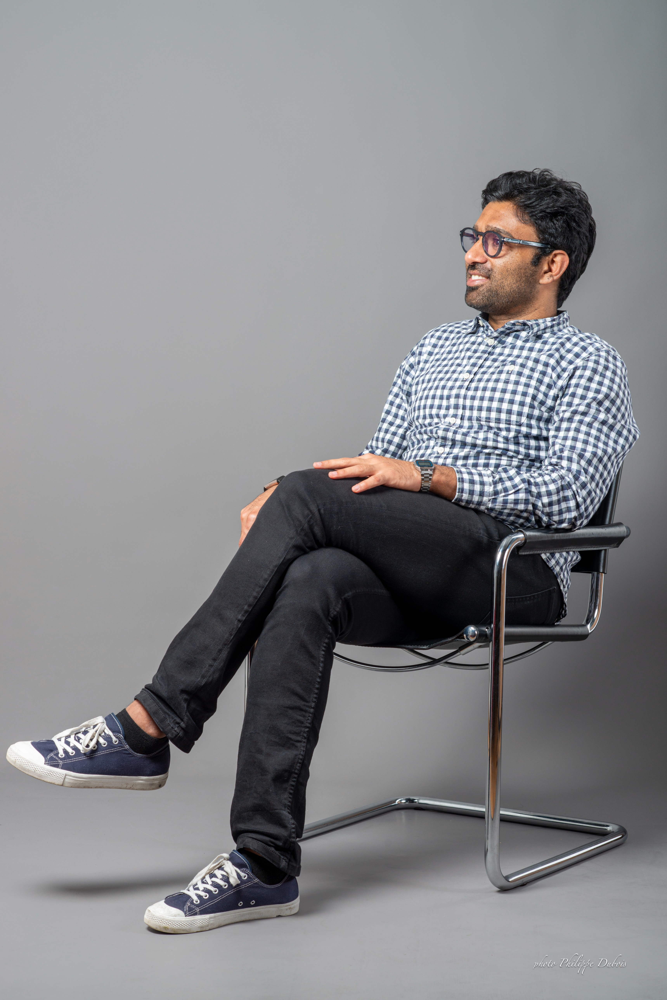

## Senior Application Development Specialist | Full-Stack Developer

### About Me
I am an experienced Full-Stack Developer with over 10 years of expertise in Java, Spring Boot, and Angular. I have worked on scalable applications and led teams in Agile environments. My passion for innovative IT solutions is complemented by my educational background in AI and Machine Learning.

### Skills
- **Programming Languages:** Java, Python, Visual Basic
- **Frameworks & Tools:** Spring Boot, Angular, Jenkins, Docker
- **Cloud Technologies:** AWS, CloudFoundry
- **Databases:** MySQL, PostgreSQL, DB2, MongoDB, MSSQL Server
- **Languages:** German (C1), English (C1-C2), Urdu (Native), Sindhi (Native)

### Education
- **Master's in Information Engineering**, Universität Konstanz (Focus: AI and Machine Learning)
- **Exchange Semester**, Vienna University of Technology (Software Engineering and Internet Computing)
- **Bachelor's in Computer Science & IT**, NED University of Engineering and Technology

### Professional Experience
#### FAU (Bern, Switzerland)
**Professional and Personal Development** (May 2024 – Present)
- Engaged in learning new work formats, agile methods, personal branding, and self-presentation.

#### IBM (Bern, Switzerland)
**Senior Application Developer** (Jan 2022 – Jun 2023)
- Developed projects for the Swiss Federal Office of IT.
- **Tech:** Java 11, Spring Webflux, Angular, Postgres SQL, Docker, Jenkins.

#### Accenture (Hamburg, Germany)
**Application Development Specialist** (Sep 2019 – Dec 2021)
- Developed web services for GDPR compliance at KfW Bank.
- **Tech:** Java, Spring Boot, AWS, CI/CD.

#### OTTO GmbH & Co KG (Hamburg, Germany)
**Software Developer** (Feb 2017 – Jan 2019)
- Enhanced CMS and migrated microservices to AWS.
- **Tech:** Java, Spring Boot, AngularJS, AWS.

#### Universität Konstanz (Germany)
**Student Research Assistant** (Nov 2013 – Apr 2015)
- Worked on the "DAMIART" project for data mining using ART neural networks.
- Contributed to the development of datasets for classification and implemented hierarchical performance measures.
- Led the integration of the MEKA library for multi-label classification.
- Supervised the development of the "Rule Explorer" module in KNIME for visualization and analysis of fuzzy rules and associations.
- For more details on the project, see the [DAMIART publication](https://www.uni-konstanz.de/mmsp/pubsys/publishedFiles/BeSa14a.pdf){:target="_blank"}.


#### TPS Pakistan (Karachi, Pakistan)
**Software Engineer** (Dec 2012 – Aug 2013)
- Developed card production and personalization software, integrating Visa/MasterCard into existing systems.
- **Tech:** Visual Basic, MS SQL Server, Seagate Crystal Reports.

#### Workstream Automation (Karachi, Pakistan)
**Software Developer** (Jan 2012 – Nov 2012)
- Contributed to Workstream Business Analyst and Intelligence tools.
- **Tech:** Java, Vaadin, Hibernate, MSSQL, MySQL, XML.

#### AutoSoft Dynamics (Karachi, Pakistan)
**Software Programmer** (Jun 2010 – Dec 2011)
- Created software for bank treasury (ADAMS).
- **Tech:** Power Builder, SQL Server.

#### Catcos (Karachi, Pakistan)
**Network Administrator** (Feb 2010 – Jun 2010)
- Managed network services and infrastructure.



### Certifications
- **Persuade Rhetorically**, Echo-Training (Issued Oct 2024)
- **Prompt Engineering with ChatGPT**, LinkedIn (Issued Oct 2024)
- **New Work - Principles, Frameworks and Methods**, Explorativa (Issued Sep 2024)
- **Personal Branding**, VANK Consulting GmbH (Issued Sep 2024)
- **Essentials for Solution Engineers**, LinkedIn (Issued Aug 2024)
- **Success Through Inner Strength**, About You (Issued Aug 2024)
- **API Security**, Accenture (Issued Mar 2021)
- **Java Reactive Programming [From Scratch]**, Udemy (Issued Jan 2023)

### Publications
- [Developing a system for securely timestamping and visualizing changes in online news content.](https://arxiv.org/abs/1802.07285){:target="_blank"}

### Contact
- **Email:** [waqar.detho@gmail.com](mailto:waqar.detho@gmail.com){:target="_blank"}
- **LinkedIn:** [linkedin.com/in/waqaralidetho](https://www.linkedin.com/in/waqaralidetho){:target="_blank"}

  ```html
<!-- Contact Form -->
<form action="https://formspree.io/f/myzzeryo" method="POST" style="max-width: 600px; margin: auto; background: #f9f9f9; padding: 20px; border-radius: 8px; box-shadow: 0 4px 6px rgba(0, 0, 0, 0.1);">
  <h3 style="text-align: center; color: #333;">Contact Me</h3>
  <label style="display: block; margin: 10px 0 5px; color: #555;">
    Your Email:
    <input type="email" name="email" required style="width: 100%; padding: 10px; border: 1px solid #ddd; border-radius: 4px;">
  </label>
  <label style="display: block; margin: 10px 0 5px; color: #555;">
    Your Message:
    <textarea name="message" required style="width: 100%; padding: 10px; border: 1px solid #ddd; border-radius: 4px; height: 100px;"></textarea>
  </label>
  <button type="submit" style="display: block; width: 100%; background: #007BFF; color: #fff; border: none; padding: 10px 20px; border-radius: 4px; cursor: pointer;">
    Send
  </button>
</form>
```

### Download CV
- [Download My CV](WaqarADethoResume.pdf){:target="_blank"}
